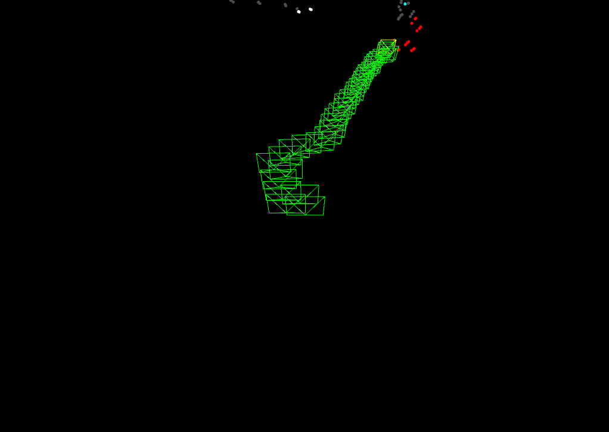
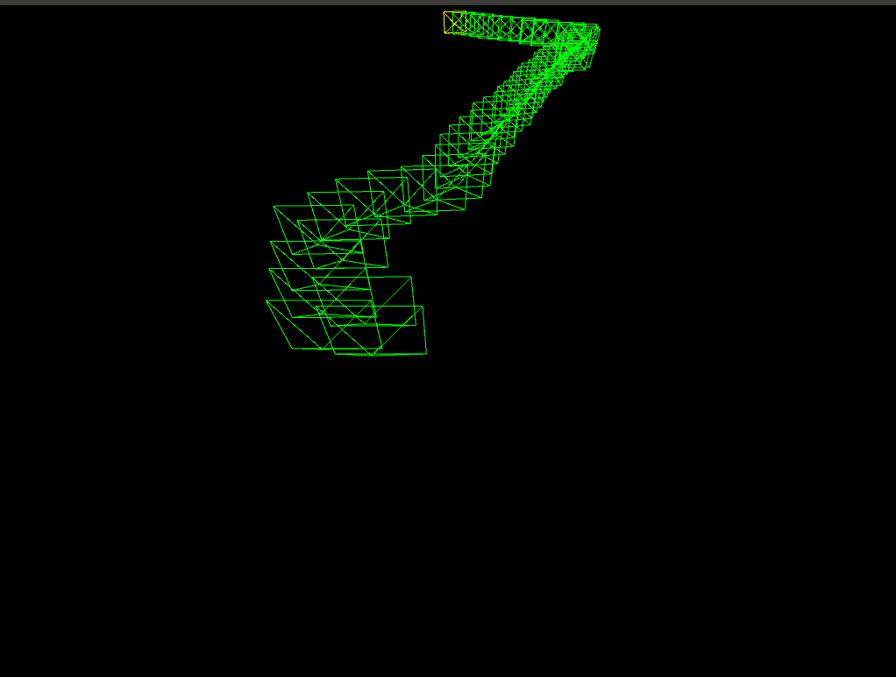
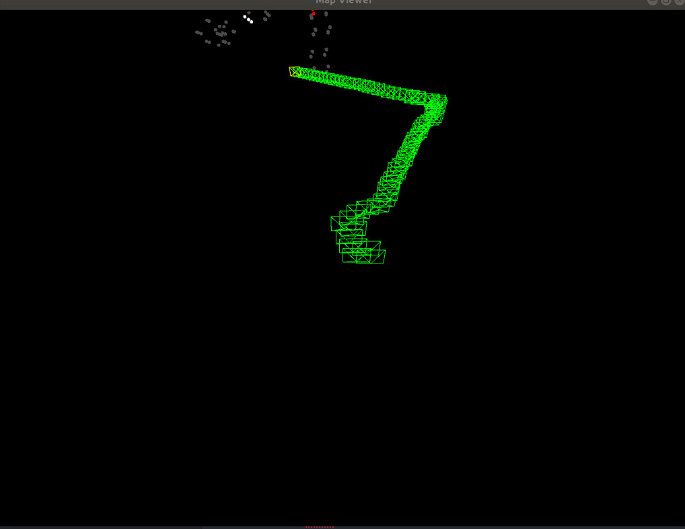
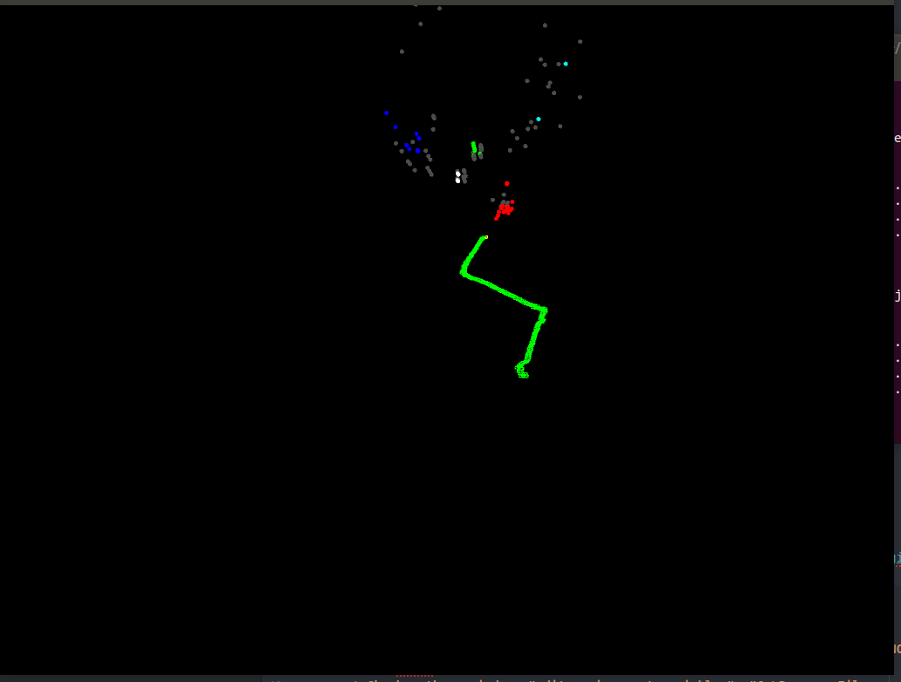
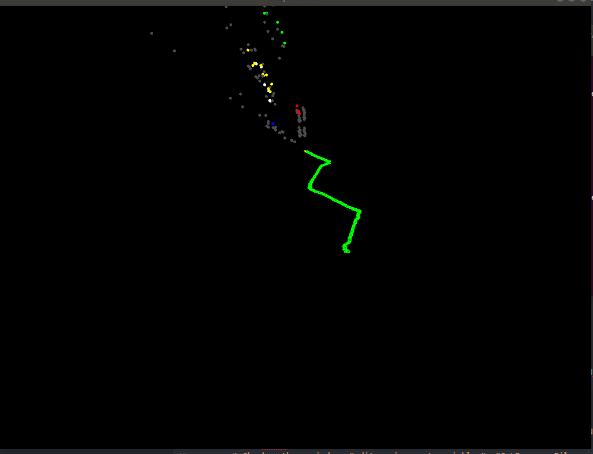
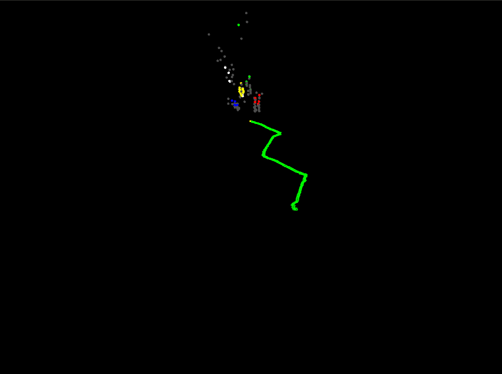
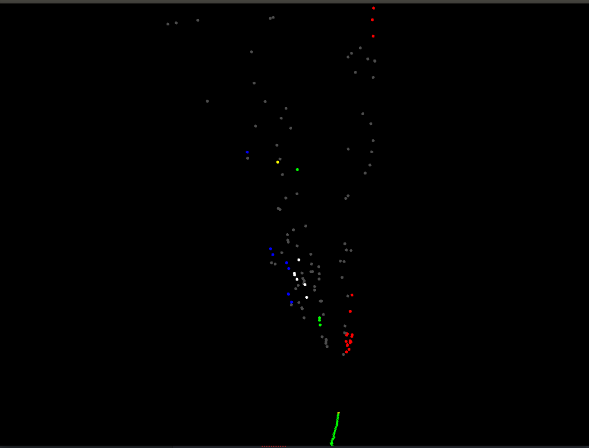
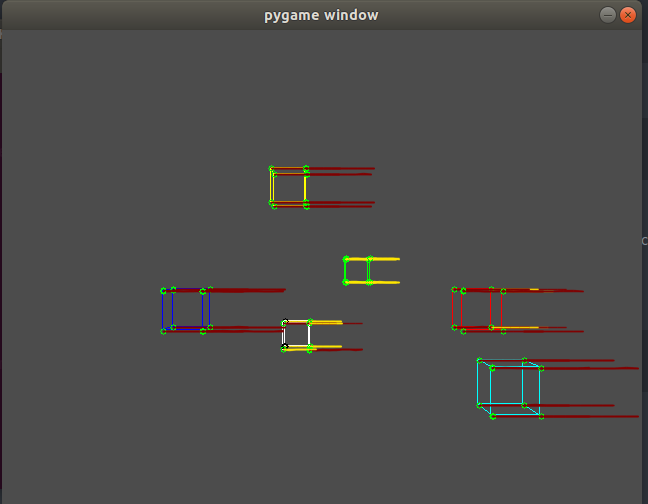
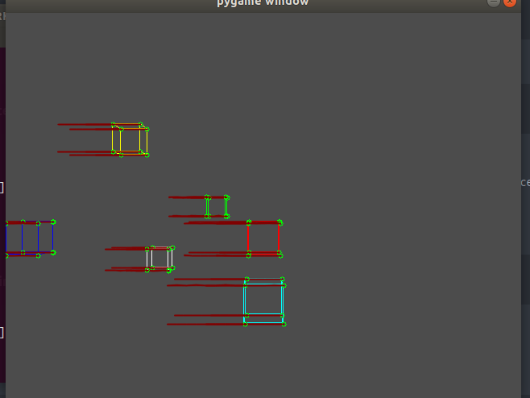
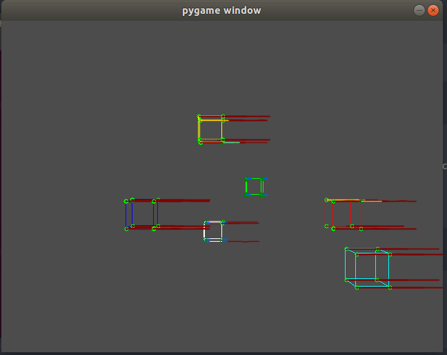

## ToySLAM inspired by George Hotz
      I am implementing this for my company project -- see_through_future
      Refactor toyslam for further development

## How to RUN
   * python fakeslam.py
   * python SLAM.py <video.mp4>
     * e.g. python SLAM.py videos/*.mp4

## Steps for the SLAM
      1. Input Image Sequence.
      2. Feature Detector (ORB, BFF Matcher)
      3. Matching Criteria (Error Definition)--> Distance Measurement (hamming distance, mahalanobis)
      4. Error Optimizer, (Bundle Adjustment)
      5. Loop Closure.
      6.

## Directory Explanation
      * The main module: slam.py where all the other modules are called.
      * data -- storing the test videos
      * constants.py -- store the constants

## Libraries Used:
      * cv2 for feature extraction
      * pangolin for 3-D Display, python wrapper
        around pangolin
      * g2opy for optimization

## Walkthrough

## CI/CD
       * Use github CI/CD pipline --> .yml

## Results
  * 
  * 
  * 
  * 
  * 
  * 
  * 
  * 
  * 
  * 
  * 

## TODO
       * Check error "__lib" at MinGW32-make install
       * Check: https://github.com/stevenlovegrove/Pangolin/issues/425 (For AND NOT _WIN_ cmake file)
       * Check path on windows "edit environment variables": "C:\Program Files error"
       * Complete installation of pangolin
       * Read on multiprocessing in Python: https://www.journaldev.com/15631/python-multiprocessing-example
       * TODO: "MOST IMPORTANT Try OpenVSLAM on my Ubuntu and test the installation of Pangolin"
       * TODO: Read on Flame "https://ps.is.tuebingen.mpg.de/uploads_file/attachment/attachment/400/paper.pdf"
       * TOREAD: "https://skarredghost.com/2021/02/01/facebook-quest-2-sales-valve-bci/?fbclid=IwAR1qdriND7Lh3sbQtWsQ_tGz_LmfsHNsH0QWmnLbP_yqdJicXMMt-ZQZwO4"
       * TODO: https://www.youtube.com/watch?v=4qBe_Vvzq_c How to run OpenVSLAM on iphone
       * Build using DockerImage (Use Docker to always build before getting it on local)
